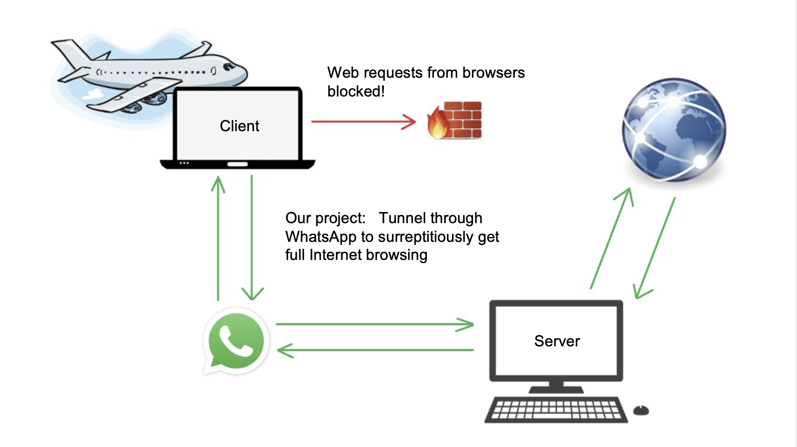
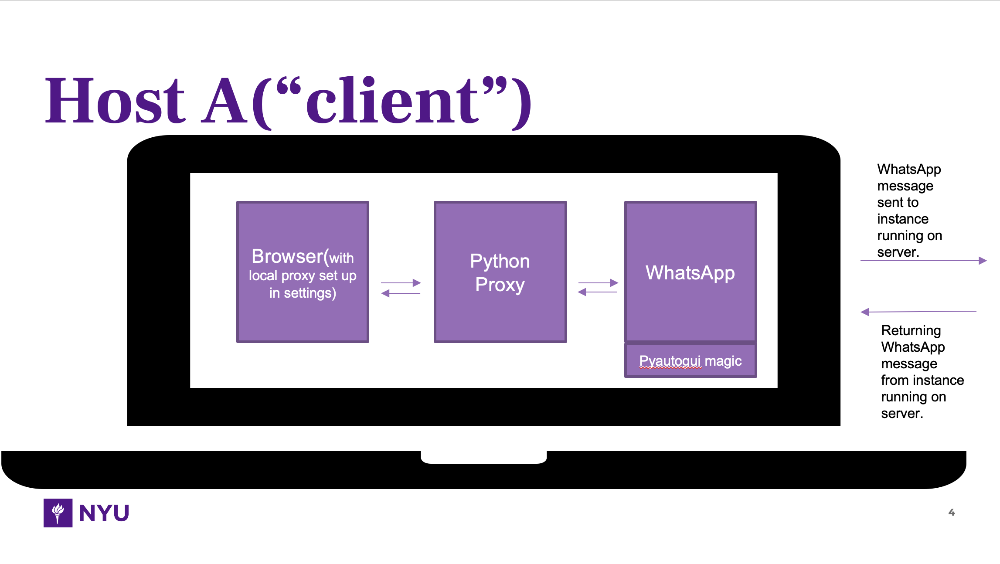
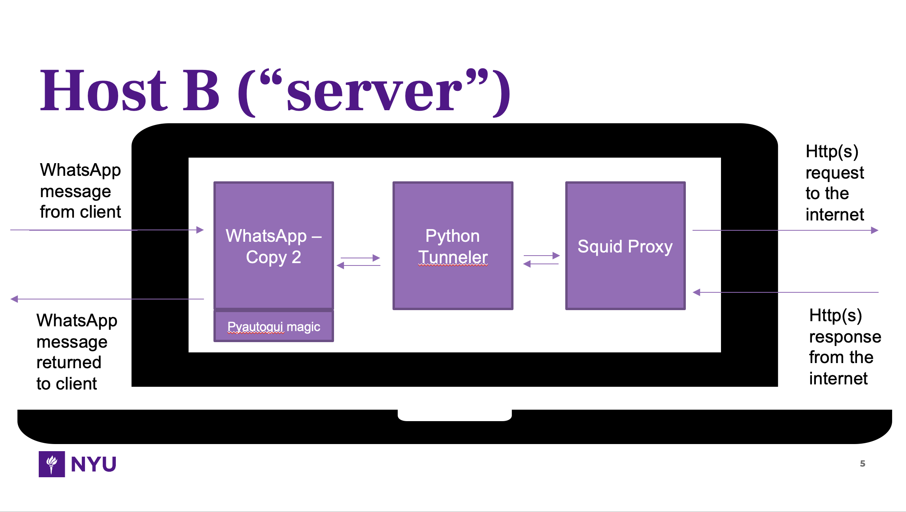
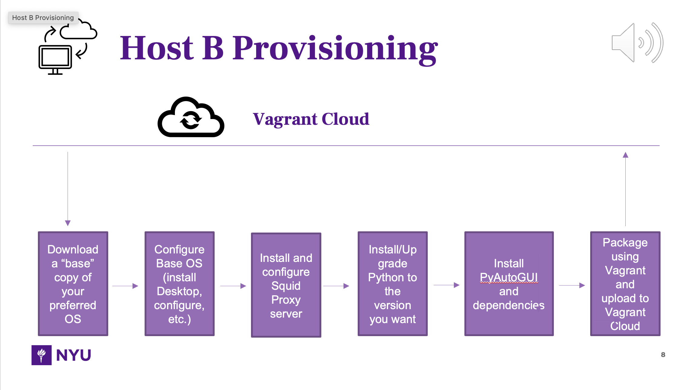
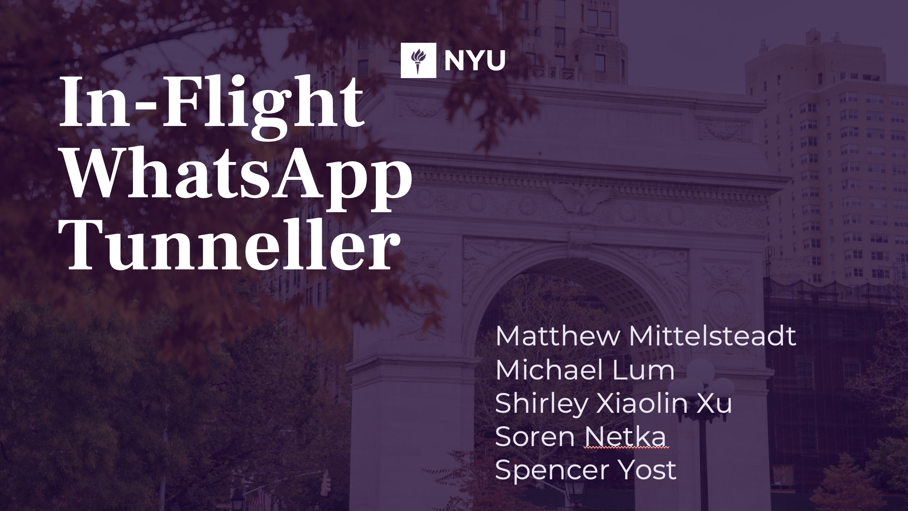

# WhatsAppTunneler
Bypass in-flight WiFi firewall by tunnelling traffic through WhatsApp messenger to a ground server, which forwards requests and sends the response back to the client on the plane as a plaintext message.

## [Project Report](./assets/demo/Whatsapp%20Project.pdf)
### Excerpt:
> Most modern airlines offer in-flight wifi... for a price. Some airlines offer free in-flight messaging over WiFi, but restrict browsing traffic on the network. For this project, we hypothesized that we could bypass the in-flight firewall by creating a proxy tunnel through WhatsApp Messenger. By tunneling traffic through WhatsApp to an internet-connected computer on the ground, we are able to visit otherwise restricted websites while in the air. This project simulates a proof-of-concept rather than a live exploit, because we are mere graduate students, not professional hackers. The insight here, perhaps, is that like insects, attackers will find the tiniest openings in your walls and sneak through undetected. It also means that despite forcing the customer to pay for in-flight wifi, it is possible to still browse the internet using a free service and an unconventional method.

## [Slide Deck](./assets/demo/WhatsApp-Tunneller.pptx)

### Slide deck preview:

## Dependencies

- Virtual Machine Repository: [NCDiesel/squid-ubuntu-2004](https://github.com/NCDiesel)

&nbsp;&nbsp;&nbsp;&nbsp;&nbsp;&nbsp;The repository will be kept public through the end of class(~8-16). Anyone wanting access longer than that please contact Spencer Yost

- HashiCorp Vagrant
- VirtualBox
- Squid
- WhatsApp Desktop
- PyAutoGui
- Python3

---
Final project for NYU Mobile Security Summer 2021.
